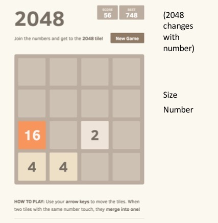

## 2048x

[live](https://nevindnl.github.io/2048x)

### Background

2048 is a single-player game played on a 4x4 grid. At the start, the grid is populated with two 2 blocks. The player can tilt the board up, down, left, or right, and pieces will slide as far as they can go in their respective rows and columns. If two pieces with the same power of 2 on them slide together, they are combined into one block that contains the next power of 2. After each tilt which moves pieces, another 2 block or 4 block is added to the grid.

The goal of the game is to form a 2048 block, that is, a block with 2^10. The game is lost if the grid becomes filled.

### Functionality & MVP  

Users will be able to:

- [ ] Start and reset the game board
- [ ] See score and best score
- [ ] Change grid size
- [ ] Change base value

In addition, this project will include:

- [ ] A How to Play section
- [ ] A production Readme

### Wireframes

This app will consist of a single screen with game board and nav links to the Github and my LinkedIn.  There will be a New Game button, score icons, and inputs for grid size and base value.  

### Architecture and Technologies

This project will be implemented with the following technologies:

- Vanilla JavaScript and `jquery` for overall structure and game logic,
- `Easel.js` with `HTML5 Canvas` for DOM manipulation and rendering,
- Webpack to bundle and serve up the various scripts.

In addition to the webpack entry file, there will be three scripts involved in this project:

`board.js`: this script will handle the logic for creating and updating the necessary `Easel.js` elements and rendering them to the DOM.

`game.js`: this script will handle the logic behind the scenes.  A Game object will hold `size` and `base` attributes and a 2D array of `Cell`s.  It will be responsible for doing neighbor checks for each `Cell` upon iteration and updating the `Cell` array appropriately.

`cell.js`: this lightweight script will house the constructor and update functions for the `Cell` objects.  Each `Cell` will contain a `number`.

### Implementation Timeline

**Day 1**: Setup all necessary Node modules, including getting webpack up and running and `Easel.js` installed.  Create `webpack.config.js` as well as `package.json`.  Write a basic entry file and the bare bones of all 3 scripts outlined above.  Learn the basics of `Easel.js`.  Goals for the day:

- Get a green bundle with `webpack`
- Learn enough `Easel.js` to render an object to the `Canvas` element

**Day 2**: Dedicate this day to learning the `Easel.js` API.  First, build out the `Cell` object to connect to the `Board` object.  Then, use `board.js` to create and render at least the square grid. Goals for the day:

- Complete the `cell.js` module (constructor, update functions)
- Render a square grid to the `Canvas` using `Easel.js`
- Make each cell in the grid tilt, toggling tilt with arrow keys

**Day 3**: Create the backend. Incorporate the logic into the `board.js` rendering.  Goals for the day:

- Export an `Game` object with correct parameters and handling logic
- Have a functional grid on the `Canvas` frontend that correctly handles moves

**Day 4**: Install the inputs for the user to interact with the game.  Style the frontend, making it polished and professional.  Goals for the day:

- Create controls for reset, grid size, base
- Have a styled `Canvas`, nice looking controls and title
