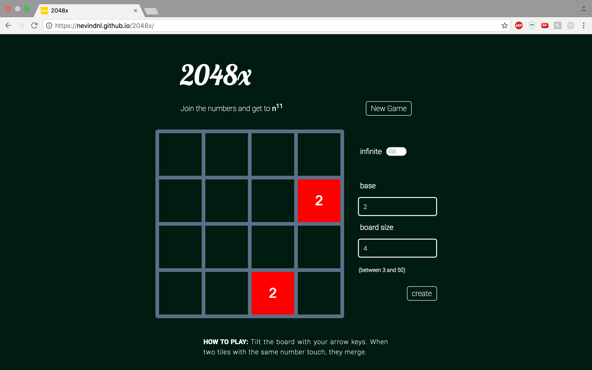

## 2048x

[live](https://nevindnl.github.io/2048x)

2048x is a spinoff of the popular web game 2048, allowing the player to adjust the number base and grid size. It was made with JavaScript, HTML5/CSS3, and some jQuery.




### Implementation
* [Cell][cell]
  * Stores value and position on grid, as well as drawing logic.
* [Board][board]
  * Stores grid, tilting logic, and game termination logic.
* [Game][game]
  * Stores game options, draws and installs event handlers on container, and handles player interaction logic.

  [cell]: ./lib/cell.js
  [board]: ./lib/board.js
  [game]: ./lib/game.js

Tilting was implemented by mapping the grid, according to the tilt direction, to a grid to be left-tilted, left-tilting, and then undoing the isomorphism.

```Javascript
tilt(i, j){
	function toLeft(){
		if (j !== 0){
			this.grid = Util.transpose(this.grid);
		}
		if (i + j > 0){
			this.grid = this.grid.map(row => row.reverse());
		}
	}

	function fromLeft(){
		if (i + j > 0){
			this.grid = this.grid.map(row => row.reverse());
		}
		if (j !== 0){
			this.grid = Util.transpose(this.grid);
		}
	}

	toLeft.call(this);
	this.leftTilt();
	fromLeft.call(this);
}

leftTilt(){
	this.grid = this.grid.map(row => {
		//remove spaces
		const tilted = row.filter(cell => cell.n !== -1);

		//merge
		let j = 0;
		while(j < tilted.length - 1){
			let [cell, nextCell] = tilted.slice(j, j + 2);

			if (cell.n === nextCell.n){
				cell.n += 1;
				cell.merged = true;
				tilted.splice(j + 1, 1);
			}

			j += 1;
		}

		//append spaces as needed
		while(tilted.length < this.size){
			tilted.push(new Cell(-1));
		}

		return tilted;
	});
}
```

DOM methods were used to render the grid:

```Javascript
drawGrid(){
	document.querySelectorAll('.grid-container div').forEach(div => {
		div.remove();
	});

	document.getElementsByClassName('grid-container')[0].style.width = this.dim + 'px';
	document.getElementsByClassName('grid-container')[0].style.height = this.dim + 'px';
	document.getElementsByTagName('canvas')[0].height = this.dim;
	document.getElementsByTagName('canvas')[0].width = this.dim;

	const cellDim = this.cellDim - 2 * this.cellBorder + 'px';
	for (let i = 0; i < Math.pow(this.size, 2); i++){
		const div = document.createElement('div');
		div.style.width = cellDim;
		div.style.height = cellDim;
		div.style.border = `${this.cellBorder}px solid #6ccbf9`;
		document.getElementsByClassName('grid-container')[0].appendChild(div);
	}
}
```

whereas HTML5 Canvas was used to render individual cells.

```Javascript
draw(ctx, cellDim, base){
	if (this.n === -1){
		return;
	}

	let fontSize;
	if (cellDim <= 14){
		fontSize = 0;
	} else if (cellDim <= 23){
		fontSize = 4;
	} else if (cellDim <= 30){
		fontSize = 6;
	} else if (cellDim <= 40){
		fontSize = 8;
	}else if (cellDim <= 53){
		fontSize = 10;
	} else if (cellDim <= 77){
		fontSize = 14;
	} else {
		fontSize = 24;
	}

	const number = JSON.stringify(Math.round(Math.pow(base, this.n) * 100)/100);
	const dec = number.length - 4;

	fontSize = dec > 0 ? Math.floor(fontSize * Math.pow(.9, dec)) : fontSize;

	ctx.font = `100 ${fontSize}pt sans-serif`;
	ctx.textAlign = 'center';
	ctx.textBaseline = 'middle';

	const [x, y] = [this.j * cellDim, this.i * cellDim];

	ctx.fillStyle = this.n === 11 ? '#ffd700' : COLORS[this.n % 10];
	ctx.fillRect(x, y, cellDim, cellDim);

	ctx.fillStyle = 'white';
	ctx.fillText(number, x + cellDim / 2, y + cellDim / 2);
}
```
